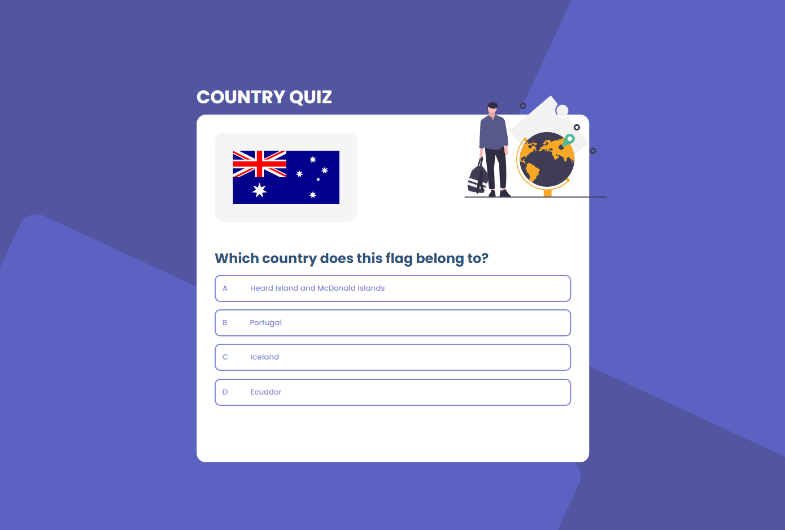
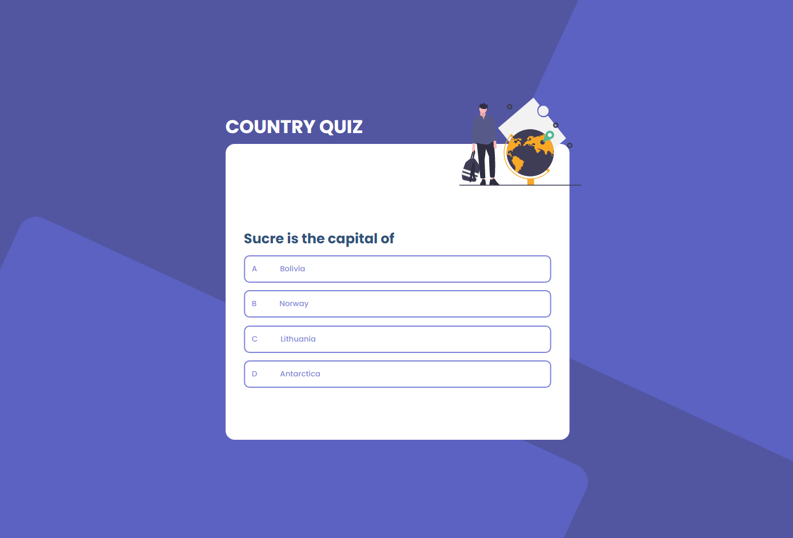

<!-- Please update value in the {}  -->

<h1 align="center">Country Quiz</h1>

<div align="center">
   Solution for a challenge from  <a href="http://devchallenges.io" target="_blank">Devchallenges.io</a>.
</div>

<div align="center">
  <h3>
    <a href="https://bozgen.github.io/devChallenges/country-quiz">
      Demo
    </a>
    <span> | </span>
    <a href="https://github.com/bozgen/devChallenges/tree/main/country-quiz">
      Solution
    </a>
    <span> | </span>
    <a href="https://devchallenges.io/challenges/Bu3G2irnaXmfwQ8sZkw8">
      Challenge
    </a>
  </h3>
</div>

<!-- TABLE OF CONTENTS -->

## Table of Contents

- [Overview](#overview)
  - [Built With](#built-with)
- [Features](#features)
- [How to use](#how-to-use)
- [Contact](#contact)
- [Acknowledgements](#acknowledgements)


<!-- OVERVIEW -->
<br>

## Overview

### The quiz currently has two types of questions:

<br>

- #### Flag Questions

  
  <br><br>
- #### Capital Questions

  


### See the demo [here](https://bozgen.github.io/devChallenges/country-quiz).

<br>

  This was a really fun project to build. The design is really cool and the API is pretty straight-forward to work with.
  
  I used the [REST Countries API](https://restcountries.com/) to build this project. 


### Built With

<!-- This section should list any major frameworks that you built your project using. Here are a few examples.-->
- [React](https://reactjs.org/)

## Features

<!-- List the features of your application or follow the template. Don't share the figma file here :) -->
Stories:

- Answer different types of questions about countries all over the world.
- See if your answer is correct or not.
- Move on to the next question if you are right.
- See your results if your answer is wrong.
- Try again


This application/site was created as a submission to a [DevChallenges](https://devchallenges.io/challenges) challenge. The [challenge](https://devchallenges.io/challenges/Bu3G2irnaXmfwQ8sZkw8) was to build an application to complete the given user stories.


## How To Use

<!-- Example: -->

To clone and run this application, you'll need [Git](https://git-scm.com) and [Node.js](https://nodejs.org/en/download/) (which comes with [npm](http://npmjs.com)) installed on your computer. From your command line:

```bash
# Clone this repository
$ git clone https://github.com/your-user-name/your-project-name

# Install dependencies
$ npm install

# Run the app
$ npm start
```

## Acknowledgements

<!-- This section should list any articles or add-ons/plugins that helps you to complete the project. This is optional but it will help you in the future. For example: -->

- [Node.js](https://nodejs.org/)
- [React](https://reactjs.org/)
- [REST Countries API](https://restcountries.com)

## Contact

- GitHub [@your-username](https://github.com/bozgen)
- Twitter [@your-twitter](https://twitter.com/_bozgen)
