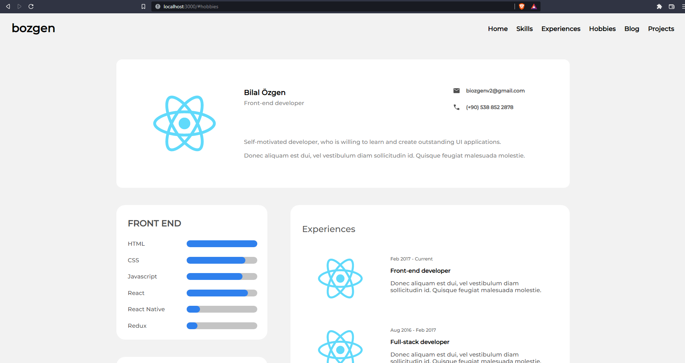

<!-- Please update value in the {}  -->

<h1 align="center">bozgen portfolio</h1>

<div align="center">
   Solution for a challenge from  <a href="http://devchallenges.io" target="_blank">Devchallenges.io</a>.
</div>

<div align="center">
  <h3>
    <a href="https://bozgen.github.io/portfolio">
      Demo
    </a>
    <span> | </span>
    <a href="https://github.com/bozgen/devChallenges/tree/main/portfolio">
      Solution
    </a>
    <span> | </span>
    <a href="https://devchallenges.io/challenges/5ZnOYsSXM24JWnCsNFlt">
      Challenge
    </a>
  </h3>
</div>

<!-- TABLE OF CONTENTS -->

## Table of Contents

- [Overview](#overview)
  - [Built With](#built-with)
- [Features](#features)
- [How to use](#how-to-use)
- [Contact](#contact)
- [Acknowledgements](#acknowledgements)

<!-- OVERVIEW -->

## Overview



In this project I created a portfolio website using React.

You can see the demo [here](https://bozgen.github.io/portfolio)

The challenging parts of this project were:

- Creating a filter feature from scratch for the projects section.
- Displaying the projects page by page, 3 at a time.
- Alignment (CSS Grid)


The things that I have learned/improved while working with this project are:

- (CSS) Alignment by CSS-grid
- (React) Component lifecycles
- (React) Memoizing the components to optimize performance
- (React) Dealing with the es-lint dependency array warnings by using useCallback hook
- What was your experience?

It was a really fun project to make and it only took about a 2 days to finish up.

The fact that the design was already provided really helps focusing on the technical side of the project. Now, I surely feel a lot more confident about front-end development using React framework.


### Built With

<!-- This section should list any major frameworks that you built your project using. Here are a few examples.-->
- [React](https://reactjs.org/)


## Features
<!-- List the features of your application or follow the template. Don't share the figma file here :) -->
Some of the major features this website has:

- Navigate through the page using the header navigation bar.
- Display skills, experiences and hobbies dynamically and categorized since the related components are reusable. e.g. Front-end skills , back-end skills, education experiences, work experience and so on.
- Display blogs.
- Display your projects and tag them so that the projects can be filtered.
- Redirect to project codes or demos easily.


This website was created as a submission to a [DevChallenges](https://devchallenges.io/challenges) challenge. The [challenge](https://devchallenges.io/challenges/5ZnOYsSXM24JWnCsNFlt) was to build an application to complete the given user stories.

## How To Use

<!-- Example: -->

To clone and run this application, you'll need [Git](https://git-scm.com) and [Node.js](https://nodejs.org/en/download/) (which comes with [npm](http://npmjs.com)) installed on your computer. From your command line:

```bash
# Clone this repository
$ git clone https://github.com/your-user-name/your-project-name

# Install dependencies
$ npm install

# Run the app
$ npm start
```

## Acknowledgements

<!-- This section should list any articles or add-ons/plugins that helps you to complete the project. This is optional but it will help you in the future. For example: -->

- [Node.js](https://nodejs.org/)
- [React](https://reactjs.org/)

## Contact

- GitHub [@bozgen](https://github.com/bozgen)
- Twitter [@_bozgen](https://twitter.com/bozgen)
